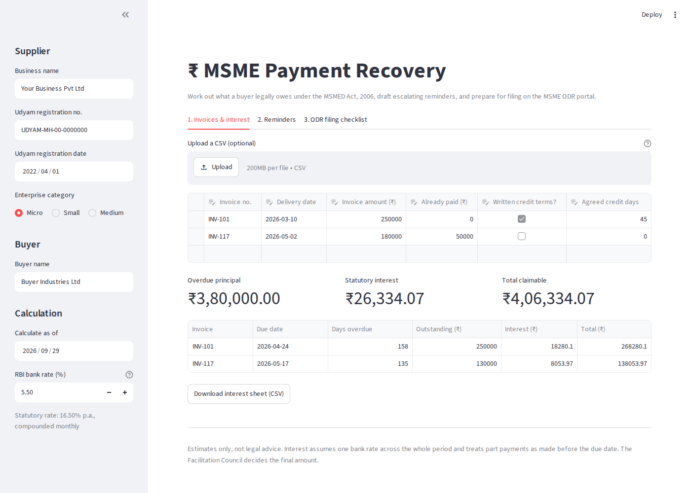

# ₹ MSME Payment Recovery

A tool for micro and small suppliers in India to recover overdue payments from buyers.

1. **Invoices & interest**: enter or upload invoices and get due dates, days overdue and statutory interest under
   Sections 15–16 of the MSMED Act, 2006 (three times the RBI bank rate, compounded monthly).
2. **Reminders**: three escalation stages (friendly → firm with interest → final notice before ODR filing) in
   English and Marathi, with an optional interest waiver and a one-click WhatsApp share.
3. **ODR filing checklist**: eligibility, documents and steps for [odr.msme.gov.in](https://odr.msme.gov.in).

Estimates only, not legal advice. See `docs/go-to-market.md` for how this is being validated.



## Run locally

```
pip install -r requirements.txt
streamlit run streamlit_app.py
```

## Tests

```
pip install -r requirements.txt -r requirements-dev.txt
python -m pytest
```

## Adding a language

Add an entry to `TEMPLATES` and `LANGUAGES` in `recovery/templates.py` with the same tier keys and placeholders.
`tests/test_interest.py` checks every language renders every tier. Get a native speaker to proofread.

## Updating the bank rate

The sidebar defaults to 5.50% (RBI policy of 5 Aug 2026). Update the default in `streamlit_app.py` after each
RBI policy review. The next review is due on 7 Oct 2026.
